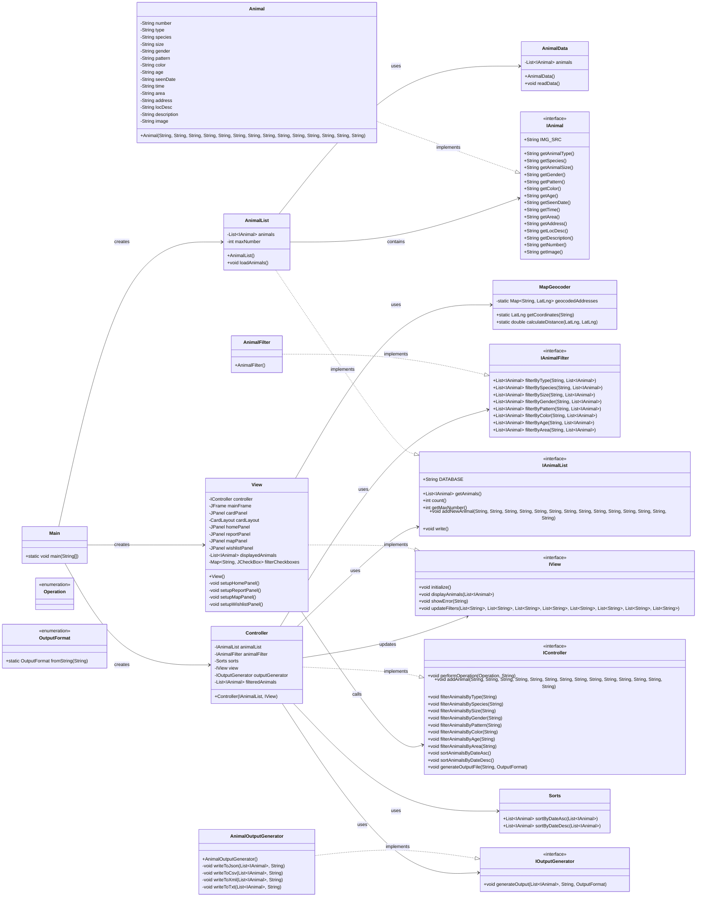

# Dog Station UML Diagram

This UML diagram represents the main components of the Dog Station application, organized according to its MVC architecture:

1. **Model Layer**:
   - `IAnimal`: Interface defining animal properties
   - `Animal`: Implementation of the IAnimal interface
   - `IAnimalList` & `AnimalList`: Manage collections of animals
   - `IAnimalFilter` & `AnimalFilter`: Filter animals by various criteria
   - `Sorts`: Sort animals by different criteria
   - `OutputFormat`: Enum defining output formats (JSON, CSV, XML, TXT)
   - `IOutputGenerator` & `AnimalOutputGenerator`: Generate output in different formats

2. **Controller Layer**:
   - `IController` & `Controller`: Handle operations and connect the model and view
   - `Operation`: Enum defining available operations (filtering, sorting)

3. **View Layer**:
   - `IView` & `View`: Display the graphical user interface
   - `MapGeocoder`: Handle location data and geocoding

4. **Application Entry Point**:
   - `Main`: Initialize the application components

The diagram shows the relationships between these components, following the MVC architecture pattern.
