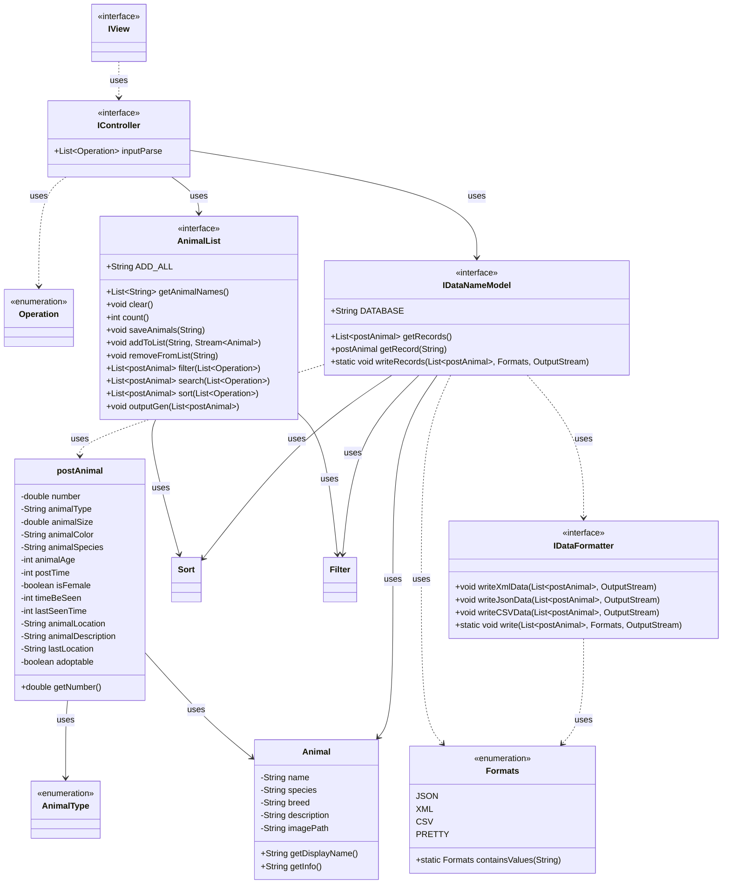
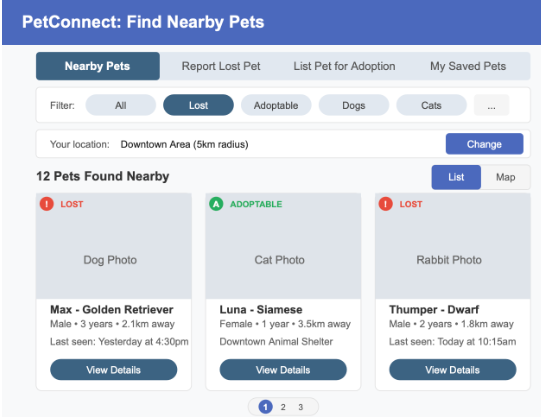
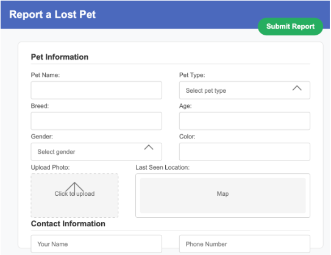
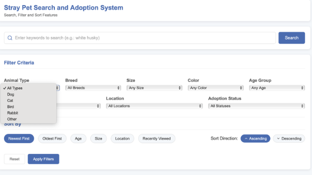
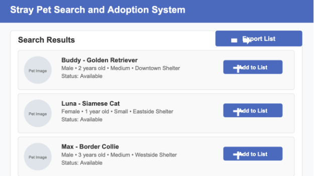

# Design Documents

# Final Project Proposal – Dog Station

## 1. What are you building?
Dog Station is a desktop application built in Java that helps users manage a collection of lost dogs. Users can search or report lost dogs, view nearby cases, maintain a wishlist. This project meets the requirement of managing a “collection” by treating each dog as a data entry, with relevant metadata stored in structured files.

## 2. What are the initial features for the application?
   View All Dogs: Display a complete list of dogs in a logical order.
   Report a Dog: Add a new lost or adoptable dog to the system.
   Wishlist: Build and manage a list of dogs users are interested in .
   Save Wishlist to File: Export the wishlist in .json/.csv/.xml format.
   Java Swing GUI: Graphical user interface for all major features.

## 3. What are the minimum additional features you plan to implement?
   Filter/Search/sort Dogs: Filter dogs by location, status,  breed .etc
   Load Saved Lists: Load previously saved wishlist or dog data from a file.
   Include Dog Images: Display dog images in the GUI from local storage.

## 4. What are your stretch goals?
   Map Simulation: Simulate “nearby dogs” by calculating distance from a user-entered location.
   Tagging System: Allow tagging dogs with custom labels (e.g., “friendly”, “shy”).
   Basic Login Simulation: Simulate different user profiles with separate wishlists.

## 5. Initial Design
   ### Architecture   
   Backend: Java (OOP, MVC structure)
   Frontend: Java Swing for UI
   Storage: JSON or CSV files for data persistence (dog list, wishlist)
   Design Pattern: MVC (Model-View-Controller)

### Persistence Format
JSON for full dog list (with fields: name, breed, location, date, status)
CSV or JSON for exported user wishlists
### Testing and Validation
JUnit for logic testing (file operations, object creation)
GUI testing via manual walkthrough (with screenshots for documentation)
### Documentation
Javadoc for all classes/methods
UML diagrams in DesignDocuments/
Application manual with screenshots in manual/
Project README with compile/run instructions and file structure

## 6. UML Diagram

## 7. Expected Outcome

- Map Simulation

- Report a Dog

- Filter/Search/sort Dogs

- Wishlist

## 8. Work Breakdown
Our team consists of three members, and we have divided responsibilities based on the MVC architecture, ensuring each member contributes to key components of the application while maintaining collaboration across the project.

## 9. Member Responsibilities
Responsible for the View layer using Java Swing. Implements the UI components for displaying, filtering, and managing the dog list. Works on user-facing interactions such as form inputs, list displays, and button triggers.
Responsible for the Model and data layer. Implements file I/O logic (reading and writing JSON/CSV files), manages the internal data structure of dogs and wishlists, and develops supporting logic for filtering, sorting, and saving data. Also in charge of writing JUnit tests.
Responsible for the Controller logic and integration of additional features. Implements control flow for adding/searching dogs and managing UI logic. Develops the “Nearby Dogs” feature based on simulated location data. Also handles documentation, including UML diagrams, the proposal, and the final user manual.

## 10. Timeline
Now - 4.11: implement backend and GUI

4.11 - 4.12: unit test for each part.

4.13-4.14: prepare for demonstration

