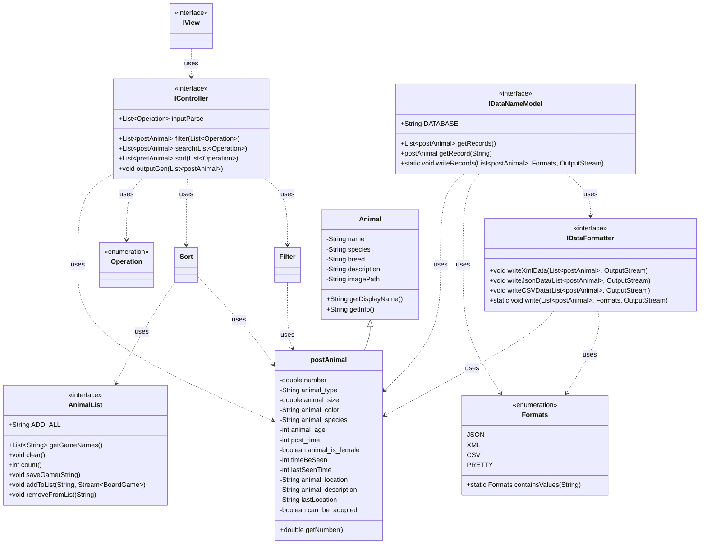

```mermaid
classDiagram
%% Model package
class postAnimal {
-double number
-String animal_type
-double animal_size
-String animal_color
-String animal_species
-int animal_age
-int post_time
-boolean animal_is_female
-int timeBeSeen
-int lastSeenTime
-String animal_location
-String animal_description
-String lastLocation
-boolean can_be_adopted
+double getNumber()
}

    %% Controller package
    class IController {
        <<interface>>
        +List~Operation~ inputParse
        +List~postAnimal~ filter(List~Operation~)
        +List~postAnimal~ search(List~Operation~)
        +List~postAnimal~ sort(List~Operation~)
        +void outputGen(List~postAnimal~)
    }
    
    class Operation {
        <<enumeration>>
    }

    %% Model.InputModel package
    class Sort {
    }
    
    class Filter {
    }

    %% Model.output package
    class IDataNameModel {
        <<interface>>
        +String DATABASE
        +List~postAnimal~ getRecords()
        +postAnimal getRecord(String)
        +static void writeRecords(List~postAnimal~, Formats, OutputStream)
    }
    
    class IDataFormatter {
        <<interface>>
        +void writeXmlData(List~postAnimal~, OutputStream)
        +void writeJsonData(List~postAnimal~, OutputStream)
        +void writeCSVData(List~postAnimal~, OutputStream)
        +static void write(List~postAnimal~, Formats, OutputStream)
    }
    
    class AnimalList {
        <<interface>>
        +String ADD_ALL
        +List~String~ getGameNames()
        +void clear()
        +int count()
        +void saveGame(String)
        +void addToList(String, Stream~BoardGame~)
        +void removeFromList(String)
    }
    
    class Formats {
        <<enumeration>>
        JSON
        XML
        CSV
        PRETTY
        +static Formats containsValues(String)
    }

    %% view package
    class IView {
        <<interface>> 
    }

    class Animal {
        -String name
        -String species
        -String breed
        -String description
        -String imagePath
        +String getDisplayName()
        +String getInfo()
    }

    %% Relationships
    IController ..> postAnimal : uses
    IController ..> Operation : uses
    IDataNameModel ..> postAnimal : uses
    IDataNameModel ..> Formats : uses
    IDataNameModel ..> IDataFormatter : uses
    IDataFormatter ..> postAnimal : uses
    IDataFormatter ..> Formats : uses
    Sort ..> AnimalList : uses 
    IController ..> Sort : uses
    IController ..> Filter : uses
    IView ..> IController : uses
    Filter ..> postAnimal : uses
    Sort ..> postAnimal : uses
    Animal <|-- postAnimal
```